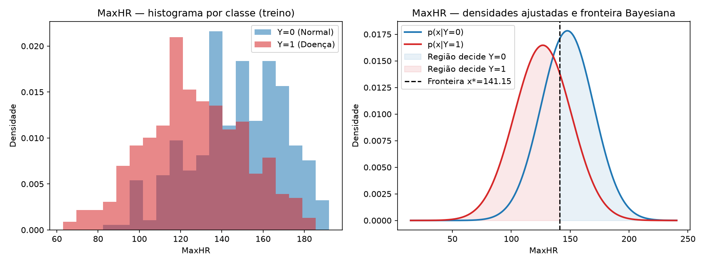
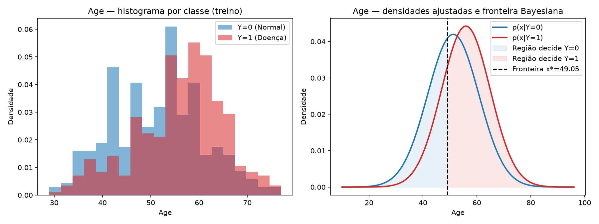
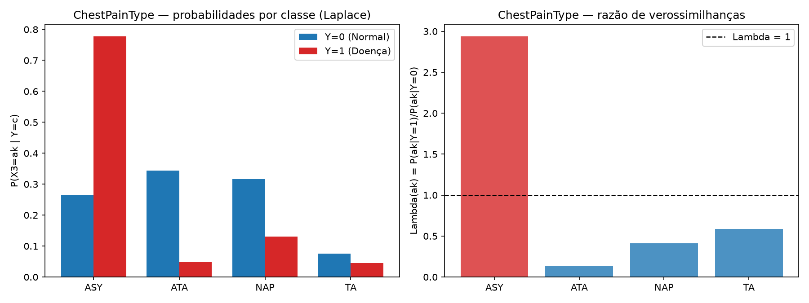
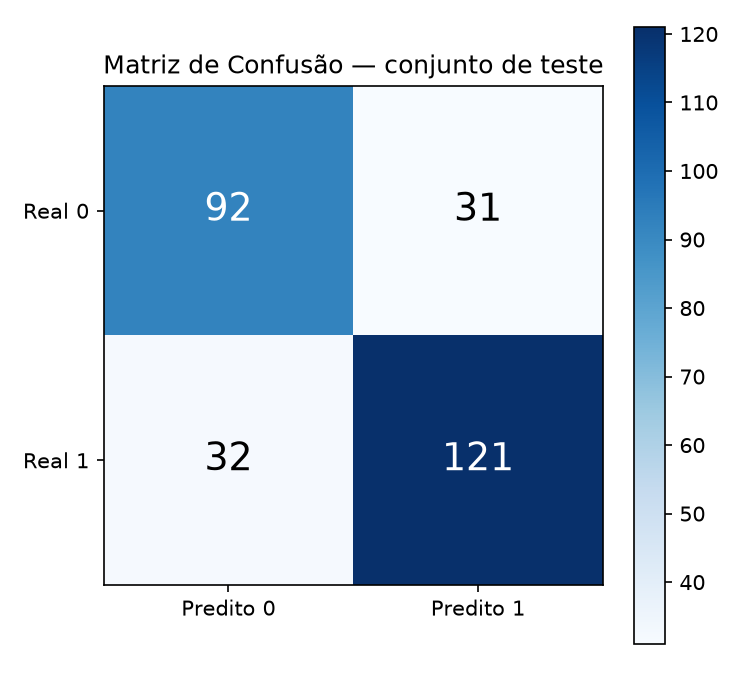

# Estudo Dirigido — Classificador Bayesiano *Naive Bayes* do zero

**Base de dados:** *Heart Failure Prediction Dataset* (Kaggle: `fedesoriano/heart-failure-prediction`)
**Variável alvo ($Y$):** `HeartDisease` — $Y=1$: presença de doença cardíaca; $Y=0$: normal.
**Características escolhidas:** $X_1=\text{MaxHR}$ (contínua), $X_2=\text{Age}$ (contínua), $X_3=\text{ChestPainType}$ (categórica).
**Implementação:** `main.py` — classificador construído do zero com NumPy/SciPy, sem `sklearn.naive_bayes`.

---

## 1. Descrição da base e do problema de classificação

A base *Heart Failure Prediction* reúne dados clínicos de 918 pacientes com o objetivo de
prever a presença de doença cardíaca. É um problema de **classificação binária
supervisionada**: a partir de um vetor de características $\mathbf{x}$, deve-se atribuir
um rótulo $\hat{y} \in \{0, 1\}$.

| Propriedade | Valor |
|---|---|
| Observações | 918 |
| Atributos | 12 (11 preditores + alvo) |
| Valores ausentes | 0 |
| Classes | `HeartDisease = 0` (Normal) e `HeartDisease = 1` (Doença) |
| Atributos numéricos | `Age`, `RestingBP`, `Cholesterol`, `FastingBS`, `MaxHR`, `Oldpeak` |
| Atributos categóricos | `Sex`, `ChestPainType`, `RestingECG`, `ExerciseAngina`, `ST_Slope` |

**Distribuição das classes na base completa:**

| Classe | Observações | Proporção |
|---|---|---|
| $Y=0$ (Normal) | 410 | 44,66% |
| $Y=1$ (Doença) | 508 | 55,34% |

A base é levemente desbalanceada em favor da classe positiva (55,3%), mas o
desbalanceamento não é severo a ponto de exigir reamostragem.

---

## 2. Seleção e justificativa das três características

O estudo exige exatamente três características, com pelo menos uma contínua e uma
categórica. Foram escolhidas:

| Notação | Atributo | Tipo | Justificativa clínica |
|---|---|---|---|
| $X_1$ | `MaxHR` | Contínua | Frequência cardíaca máxima no teste de esforço; pacientes com doença cardíaca tendem a atingir valores menores. |
| $X_2$ | `Age` | Contínua | Idade é um dos fatores de risco cardiovascular mais estabelecidos; o risco cresce com a idade. |
| $X_3$ | `ChestPainType` | Categórica (4 categorias) | O tipo de dor torácica (especialmente a assintomática, `ASY`) é fortemente associado à doença coronariana. |

A escolha permite exercitar os dois tipos de modelagem: **Normal** para contínuas e
**distribuição discreta/multinomial** para categórica, exatamente como pede o roteiro.

---

## 3. Metodologia experimental: separação treino/teste

Todos os parâmetros ($\mu$, $\sigma$, probabilidades das categorias e priors) foram
estimados **exclusivamente no conjunto de treinamento**. O teste foi usado apenas para
avaliar o classificador final.

- **Semente aleatória:** `random_state = 42`
- **Proporção:** 70% treino / 30% teste, com `stratify=y` (mantém a proporção das classes)
- **Treino:** 642 observações — $Y=0$: 287 (44,70%); $Y=1$: 355 (55,30%)
- **Teste:** 276 observações — $Y=0$: 123 (44,57%); $Y=1$: 153 (55,43%)

---

## 4. Fundamentação matemática

### 4.1 Modelo probabilístico

Para cada característica e cada classe $c \in \{0,1\}$ adota-se uma família de
distribuições $D(\theta_{jc})$:

$$
X_j \mid Y=c \;\sim\; D(\theta_{jc}).
$$

- Para **contínuas** ($X_1$ e $X_2$): distribuição **Normal**,

$$
X_j \mid Y=c \;\sim\; \mathcal{N}(\mu_c, \sigma_c^2),
\qquad
p(x_j \mid Y=c) = \frac{1}{\sqrt{2\pi\sigma_c^2}}
\exp\!\left(-\frac{(x_j-\mu_c)^2}{2\sigma_c^2}\right).
$$

  *Justificativa:* variáveis fisiológicas contínuas (frequência cardíaca máxima, idade)
  resultam da soma de muitos efeitos independentes e, pelo Teorema Central do Limite,
  tendem a ter distribuição aproximadamente Normal dentro de cada classe. Os
  histogramas por classe (Seção 5) corroboram essa forma de sino.

- Para **categórica** ($X_3$, com $K=4$ categorias $a_k$): distribuição **discreta
  (multinomial)**,

$$
P(X_3 = a_k \mid Y=c) = p_{kc}, \qquad \sum_{k=1}^{K} p_{kc} = 1.
$$

  *Justificativa:* dor torácica é uma variável nominal com 4 categorias
  (`ASY`, `ATA`, `NAP`, `TA`); não há ordem natural, logo modela-se a probabilidade de
  cada categoria por classe.

### 4.2 Estimação por Máxima Verossimilhança (no treino)

- **Priors:** $P(Y=c) = \dfrac{n_c}{n}$, onde $n_c$ é o número de observações da classe $c$ no treino.
- **Normal:** $\hat{\mu}_c = \dfrac{1}{n_c}\sum_{i:y_i=c} x_{ij}$ e
  $\hat{\sigma}_c^2 = \dfrac{1}{n_c}\sum_{i:y_i=c}(x_{ij}-\hat{\mu}_c)^2$ (MLE, `ddof=0`).
- **Categórica (com suavização de Laplace, $\alpha=1$):**

$$
P(X_3 = a_k \mid Y=c) = \frac{N_{kc} + \alpha}{n_c + \alpha K},
$$

  em que $N_{kc}$ é a contagem da categoria $a_k$ na classe $c$. A suavização evita o
  **problema da probabilidade zero**: sem ela, uma categoria ausente no treino receberia
  $p=0$, e o produto do Naive Bayes anularia toda a evidência das demais características.

### 4.3 Verossimilhança, razão de verossimilhanças e Teorema de Bayes

A **verossimilhança** $p(x \mid Y=c)$ mede quão compatível a observação $x$ é com a
classe $c$. A **razão de verossimilhanças** compara as duas classes:

$$
\Lambda(x) = \frac{p(x \mid Y=1)}{p(x \mid Y=0)}.
$$

Interpretação: $\Lambda(x)>1$ é evidência (daquela característica) em favor de $Y=1$;
$\Lambda(x)<1$ em favor de $Y=0$; $\Lambda(x)=1$ é neutralidade.

Pelo **Teorema de Bayes**, incorpora-se o conhecimento prévio $P(Y=c)$:

$$
P(Y=c \mid x) = \frac{p(x \mid Y=c)\,P(Y=c)}
{\sum_{k} p(x \mid Y=k)\,P(Y=k)}.
$$

### 4.4 Regra e fronteira de decisão

A regra de decisão MAP escolhe $\hat{y} = \arg\max_c P(Y=c \mid x)$. A **fronteira** é o
ponto em que

$$
P(Y=0 \mid x) = P(Y=1 \mid x)
\quad\Longleftrightarrow\quad
p(x\mid Y=0)\,P(Y=0) = p(x\mid Y=1)\,P(Y=1).
$$

Substituindo as densidades Normais e aplicando logaritmos, obtém-se a equação quadrática
$a x^2 + b x + c = 0$, com

$$
a=\tfrac12\left(\frac{1}{\sigma_1^2}-\frac{1}{\sigma_0^2}\right),\quad
b=\frac{\mu_0}{\sigma_0^2}-\frac{\mu_1}{\sigma_1^2},\quad
c=\tfrac12\left(\frac{\mu_1^2}{\sigma_1^2}-\frac{\mu_0^2}{\sigma_0^2}\right)
+\ln\frac{\sigma_1}{\sigma_0}+\ln\frac{P(Y=0)}{P(Y=1)}.
$$

---

## 5. Experimentos univariados (Etapas 1 a 5)

### 5.1 $X_1$ = `MaxHR` (contínua)

**Etapa 1 — Hipótese e parâmetros (treino):** $X_1 \mid Y=c \sim \mathcal{N}(\mu_c,\sigma_c^2)$.

| Classe | $n_c$ | $\hat{\mu}_c$ | $\hat{\sigma}_c$ |
|---|---|---|---|
| $Y=0$ | 287 | 147,6237 | 22,3798 |
| $Y=1$ | 355 | 126,8000 | 24,2235 |

Priors do treino: $P(Y=0)=0{,}4470$ e $P(Y=1)=0{,}5530$.

**Etapas 2–4 — Verossimilhanças, razão e posterior:**

| $x$ | $p(x\mid Y=0)$ | $p(x\mid Y=1)$ | $\Lambda(x)$ | $P(Y=1\mid x)$ | Evidência ($\Lambda$) |
|---|---:|---:|---:|---:|---|
| 90 | $6{,}478\times10^{-4}$ | $5{,}194\times10^{-3}$ | 8,0181 | 0,9084 | $Y=1$ |
| 110 | $4{,}339\times10^{-3}$ | $1{,}295\times10^{-2}$ | 2,9846 | 0,7869 | $Y=1$ |
| 130 | $1{,}307\times10^{-2}$ | $1{,}633\times10^{-2}$ | 1,2488 | 0,6070 | $Y=1$ |
| 140 | $1{,}682\times10^{-2}$ | $1{,}420\times10^{-2}$ | 0,8440 | **0,5108** | $Y=0$ |
| 150 | $1{,}773\times10^{-2}$ | $1{,}041\times10^{-2}$ | 0,5873 | 0,4208 | $Y=0$ |
| 160 | $1{,}530\times10^{-2}$ | $6{,}438\times10^{-3}$ | 0,4208 | 0,3423 | $Y=0$ |
| 170 | $1{,}081\times10^{-2}$ | $3{,}358\times10^{-3}$ | 0,3105 | 0,2775 | $Y=0$ |
| 180 | $6{,}260\times10^{-3}$ | $1{,}477\times10^{-3}$ | 0,2359 | 0,2259 | $Y=0$ |

Leitura: para $x \le 130$, a verossimilhança favorece fortemente $Y=1$ (frequência
cardíaca máxima baixa é típica de coração doente). Para $x \ge 150$, favorece $Y=0$.
Em torno de $x=140$ a característica é pouco informativa ($\Lambda \approx 0{,}84$).

**Exemplo numérico completo ($x=140$):**

$$
p(140\mid Y{=}0)=\frac{1}{\sqrt{2\pi}\cdot 22{,}3798}
\exp\!\left(-\frac{(140-147{,}6237)^2}{2\cdot 22{,}3798^2}\right)=0{,}01682,
$$

$$
p(140\mid Y{=}1)=\frac{1}{\sqrt{2\pi}\cdot 24{,}2235}
\exp\!\left(-\frac{(140-126{,}8000)^2}{2\cdot 24{,}2235^2}\right)=0{,}01420.
$$

$$
P(Y{=}1\mid 140)=\frac{0{,}01420\cdot 0{,}5530}
{0{,}01682\cdot 0{,}4470+0{,}01420\cdot 0{,}5530}
=\frac{0{,}007851}{0{,}007520+0{,}007851}=0{,}5108.
$$

Aqui está uma lição importante: $\Lambda(140)=0{,}8440<1$ indica que a **verossimilhança**
sozinha favorece $Y=0$; porém, como o prior $P(Y=1)=0{,}5530$ é maior, a **probabilidade
a posteriori** $P(Y=1\mid 140)=0{,}5108$ ligeiramente favorece $Y=1$. Verossimilhança e
posterior respondem a perguntas diferentes (Seção 7).

**Etapa 5 — Fronteira de decisão:** resolvendo a quadrática da Seção 4.4 obtêm-se as
raízes $x^* = 141{,}1457$ e $x^*=396{,}8640$. A segunda está fora do domínio fisiológico
($\text{MaxHR}\le 202$). Logo, o classificador Bayesiano univariado $h_1(x_1)$ é:

$$
\boxed{\;h_1(x_1):\quad x_1 < 141{,}15 \Rightarrow \hat{Y}=1 \qquad x_1 > 141{,}15 \Rightarrow \hat{Y}=0\;}
$$

### 5.2 $X_2$ = `Age` (contínua)

**Etapa 1 — Hipótese e parâmetros (treino):** $X_2 \mid Y=c \sim \mathcal{N}(\mu_c,\sigma_c^2)$.

| Classe | $n_c$ | $\hat{\mu}_c$ | $\hat{\sigma}_c$ |
|---|---|---|---|
| $Y=0$ | 287 | 51,2474 | 9,5040 |
| $Y=1$ | 355 | 55,9408 | 9,0186 |

**Etapas 2–4 — Verossimilhanças, razão e posterior:**

| $x$ | $p(x\mid Y=0)$ | $p(x\mid Y=1)$ | $\Lambda(x)$ | $P(Y=1\mid x)$ | Evidência ($\Lambda$) |
|---|---:|---:|---:|---:|---|
| 35 | $9{,}736\times10^{-3}$ | $2{,}985\times10^{-3}$ | 0,3066 | 0,2750 | $Y=0$ |
| 40 | $2{,}084\times10^{-2}$ | $9{,}276\times10^{-3}$ | 0,4451 | 0,3551 | $Y=0$ |
| 45 | $3{,}382\times10^{-2}$ | $2{,}119\times10^{-2}$ | 0,6266 | 0,4367 | $Y=0$ |
| 50 | $4{,}162\times10^{-2}$ | $3{,}561\times10^{-2}$ | 0,8556 | **0,5142** | $Y=0$ |
| 55 | $3{,}883\times10^{-2}$ | $4{,}400\times10^{-2}$ | 1,1331 | 0,5836 | $Y=1$ |
| 60 | $2{,}747\times10^{-2}$ | $3{,}997\times10^{-2}$ | 1,4553 | 0,6429 | $Y=1$ |
| 65 | $1{,}473\times10^{-2}$ | $2{,}671\times10^{-2}$ | 1,8128 | 0,6916 | $Y=1$ |
| 70 | $5{,}992\times10^{-3}$ | $1{,}312\times10^{-2}$ | 2,1901 | 0,7304 | $Y=1$ |
| 75 | $1{,}848\times10^{-3}$ | $4{,}742\times10^{-3}$ | 2,5662 | 0,7604 | $Y=1$ |

Leitura: pacientes jovens ($x\le 45$) fornecem evidência em favor de $Y=0$; pacientes
mais velhos ($x\ge 55$) em favor de $Y=1$. A transição ocorre perto dos 50 anos, onde a
característica é quase neutra.

**Exemplo numérico completo ($x=55$):**

$$
p(55\mid Y{=}0)=0{,}03883,\qquad p(55\mid Y{=}1)=0{,}04400,
$$

$$
P(Y{=}1\mid 55)=\frac{0{,}04400\cdot 0{,}5530}
{0{,}03883\cdot 0{,}4470+0{,}04400\cdot 0{,}5530}
=\frac{0{,}02433}{0{,}01736+0{,}02433}=0{,}5836.
$$

**Etapa 5 — Fronteira de decisão:** as raízes são $x^*=49{,}0519$ e $x^*=147{,}7456$
(fora do domínio). Dentro da faixa observada (28–77 anos), o classificador Bayesiano
univariado $h_2(x_2)$ é:

$$
\boxed{\;h_2(x_2):\quad x_2 < 49{,}05 \Rightarrow \hat{Y}=0 \qquad x_2 > 49{,}05 \Rightarrow \hat{Y}=1\;}
$$

### 5.3 $X_3$ = `ChestPainType` (categórica)

**Etapa 1 — Hipótese:** distribuição discreta com $K=4$ categorias
($a_1{=}ASY,\;a_2{=}ATA,\;a_3{=}NAP,\;a_4{=}TA$), estimada com Laplace ($\alpha=1$).

**Etapa 2 — Probabilidades $P(a_k \mid Y=c)$ estimadas no treino:**

| Categoria ($a_k$) | $P(a_k\mid Y=0)$ | $P(a_k\mid Y=1)$ |
|---|---:|---:|
| `ASY` | 0,2646 | **0,7772** |
| `ATA` | **0,3436** | 0,0474 |
| `NAP` | 0,3162 | 0,1309 |
| `TA` | 0,0756 | 0,0446 |

**Etapas 3–4 — Razão de verossimilhanças e posterior por categoria:**

| Categoria | $\Lambda(a_k)$ | $P(Y=1\mid a_k)$ | Decisão MAP |
|---|---:|---:|---|
| `ASY` | **2,9371** | 0,7842 | $\hat{Y}=1$ |
| `ATA` | 0,1378 | 0,1456 | $\hat{Y}=0$ |
| `NAP` | 0,4141 | 0,3387 | $\hat{Y}=0$ |
| `TA` | 0,5895 | 0,4217 | $\hat{Y}=0$ |

**Exemplo numérico completo (`ASY`):**

$$
P(Y{=}1\mid ASY)=\frac{0{,}7772\cdot 0{,}5530}
{0{,}2646\cdot 0{,}4470+0{,}7772\cdot 0{,}5530}
=\frac{0{,}4298}{0{,}1183+0{,}4298}=0{,}7842.
$$

A categoria `ASY` (dor assintomática) multiplica por $\approx 2{,}94$ a chance de doença
em relação à verossimilhança da classe normal — é uma evidência forte de $Y=1$. As demais
categorias favorecem $Y=0$, com `ATA` sendo a evidência mais forte contra a doença.
A categoria `TA` é a mais próxima da neutralidade ($\Lambda=0{,}5895$), porém ainda
inclina a decisão para $Y=0$; nenhuma categoria é perfeitamente neutra ($\Lambda=1$).

Observação sobre a probabilidade zero: na partição de treino obtida, nenhuma categoria de
`ChestPainType` apresentou frequência zero em alguma das classes; ainda assim, a
suavização de Laplace foi mantida como salvaguarda contra o problema da probabilidade
zero descrito na Seção 4.2.

**Etapa 5 — Regra de decisão categórica:**

$$
h_3(x_3)=
\begin{cases}
\hat{Y}=1, & \text{se } x_3 = ASY,\\
\hat{Y}=0, & \text{se } x_3 \in \{ATA,\, NAP,\, TA\}.
\end{cases}
$$

### 5.4 Comparação qualitativa das três características

Ao final das Etapas 1–5 obtêm-se os três classificadores Bayesianos univariados exigidos
pelo roteiro: $h_1(x_1)$, $h_2(x_2)$ e $h_3(x_3)$, cujas regras foram apresentadas nas
Seções 5.1 a 5.3. A comparação qualitativa deles é a seguinte.

A **`ChestPainType`** é a característica isolada mais discriminativa: a categoria `ASY`
concentra 77,7% da classe doente contra apenas 26,5% da classe normal ($\Lambda=2{,}94$),
enquanto `ATA` quase zera a probabilidade de doença ($\Lambda=0{,}14$). A **`MaxHR`**
também discrimina bem (média 147,6 na classe normal vs. 126,8 na doente, diferença de
$\approx 0{,}9\sigma$), com fronteira em 141 bpm. A **`Age`** é a mais fraca das três: as
médias diferem apenas $\approx 0{,}5\sigma$ e as curvas se sobrepõem bastante — a idade
sozinha fornece evidência útil, porém menos decisiva.

---

## 6. Classificador Naive Bayes multivariado

### 6.1 Hipótese de independência condicional

Para combinar as três evidências, o Naive Bayes assume que, **dada a classe**, as
características são condicionalmente independentes:

$$
p(x_1,x_2,x_3 \mid Y=c) \;\approx\; p(x_1\mid Y=c)\;p(x_2\mid Y=c)\;p(x_3\mid Y=c).
$$

Pelo Teorema de Bayes:

$$
P(Y=c \mid \mathbf{x}) \;\propto\; P(Y=c)\prod_{j=1}^{3} p(x_j \mid Y=c).
$$

### 6.2 Decisão no domínio logarítmico

Produtos de densidades/probabilidades menores que 1 podem causar *underflow* numérico.
Por isso a decisão é tomada no domínio logarítmico (monótono, não altera o argmax):

$$
\hat{y} = \arg\max_{c}\;\Big[\;\log P(Y=c) + \sum_{j=1}^{3}\log p(x_j \mid Y=c)\;\Big].
$$

Para contínuas usa-se o log da densidade Normal; para a categórica, o log da
probabilidade (com Laplace). Um exemplo do `main.py` (teste, índice 351:
`MaxHR=140, Age=43, ChestPainType=ASY`, verdadeiro $Y=1$):

| Classe $c$ | $\log P(Y=c)$ | $\log p(x_1\mid c)$ | $\log p(x_2\mid c)$ | $\log p(x_3\mid c)$ | Total |
|---|---:|---:|---:|---:|---:|
| 0 | $-0{,}8052$ | $-4{,}0851$ | $-3{,}5472$ | $-1{,}3297$ | $-9{,}7672$ |
| 1 | $-0{,}5924$ | $-4{,}2546$ | $-4{,}1477$ | $-0{,}2521$ | **$-9{,}2470$** |

O maior escore é o da classe 1; o classificador prevê $\hat{y}=1$ (correto). Repare que
`MaxHR=140` e `Age=43`, isoladamente, até favoreceriam a classe 0 — mas a evidência
fortíssima de `ASY` ($\log$ igual a $-0{,}25$ contra $-1{,}33$) e o prior invertem a
decisão conjunta. É exatamente a combinação de evidências que o Naive Bayes realiza.

### 6.3 Combinação de contínuas e categóricas

A contribuição de cada característica entra na soma logarítmica conforme seu tipo:

$$
\log p(\mathbf{x}\mid Y=c) =
\underbrace{\log p_{\mathcal{N}}(x_1;\mu_c,\sigma_c)}_{\text{MaxHR}}
+\underbrace{\log p_{\mathcal{N}}(x_2;\mu_c,\sigma_c)}_{\text{Age}}
+\underbrace{\log P(X_3{=}x_3\mid Y=c)}_{\text{ChestPainType}}.
$$

---

## 7. Verossimilhança × probabilidade a posteriori

Os dois conceitos respondem a perguntas diferentes:

- **Verossimilhança** $p(x\mid Y=c)$: "quão provável é observar $x$ **se** o paciente for
  da classe $c$?" — é uma propriedade da observação, fixada a classe. Não é uma
  probabilidade sobre a classe e **não** incorpora a frequência das classes.
- **Posterior** $P(Y=c\mid x)$: "dada a observação $x$, qual a probabilidade de o
  paciente ser da classe $c$?" — é a quantidade que interessa para a decisão clínica e
  incorpora o prior $P(Y=c)$.

O exemplo de `MaxHR=140` ilustra a diferença na prática: a verossimilhança favorece
levemente $Y=0$ ($\Lambda=0{,}8440<1$), mas o posterior favorece levemente $Y=1$
($P(Y=1\mid 140)=0{,}5108$), porque a classe 1 é mais frequente no treino. A
verossimilhança compara densidades; o posterior as pondera pela prevalência e normaliza.

---

## 8. Avaliação no conjunto de teste

A matriz de confusão do classificador final (linha = classe real, coluna = predita):

| | Predito 0 | Predito 1 |
|---|---:|---:|
| **Real 0 (Normal)** | **VN = 92** | FP = 31 |
| **Real 1 (Doença)** | FN = 32 | **VP = 121** |

Interpretação dos componentes:

- **VP (Verdadeiro Positivo) = 121:** pacientes doentes corretamente classificados como doentes.
- **VN (Verdadeiro Negativo) = 92:** pacientes normais corretamente classificados como normais.
- **FP (Falso Positivo) = 31:** pacientes normais erroneamente classificados como doentes
  (alarme falso — levariam a exames/tratamento desnecessários).
- **FN (Falso Negativo) = 32:** pacientes doentes erroneamente classificados como normais
  (erro mais perigoso — deixariam de receber tratamento).

**Métricas:**

| Métrica | Fórmula | Valor |
|---|---|---|
| Acurácia | $\dfrac{VP+VN}{VP+VN+FP+FN}$ | $\dfrac{213}{276}=0{,}7717$ (77,17%) |
| Precisão | $\dfrac{VP}{VP+FP}$ | $\dfrac{121}{152}=0{,}7961$ (79,61%) |
| Recall | $\dfrac{VP}{VP+FN}$ | $\dfrac{121}{153}=0{,}7908$ (79,08%) |
| F1-Score | $2\dfrac{P\cdot R}{P+R}$ | $0{,}7934$ (79,34%) |

O classificador acerta cerca de 77% dos pacientes do teste usando apenas 3
características e suposições bem simples. Os erros são equilibrados (31 FP e 32 FN),
coerente com a sobreposição das distribuições observada nas figuras.

---

## 9. Limitações da modelagem adotada

1. **Independência condicional irrealista (principal limitação do Naive Bayes):**
   `MaxHR`, `Age` e `ChestPainType` não são condicionalmente independentes — por exemplo,
   idade e frequência cardíaca máxima são correlacionadas (o MaxHR tende a diminuir com a
   idade). O modelo ignora essas correlações, o que pode distorcer as probabilidades,
   embora frequentemente ainda acerte a classe mais provável.
2. **Hipótese Normal:** as variáveis contínuas são aproximadamente, mas não exatamente,
   Gaussianas (caudas e assimetrias existem). Uma alternativa seria usar misturas ou
   estimação por kernel.
3. **Priors fixos da amostra:** usamos a prevalência do treino como $P(Y=c)$. Em cenários
   clínicos reais, a prevalência pode variar, e o prior deveria ser ajustado por
   especialistas.
4. **Poucas características:** apenas 3 dos 11 preditores foram usados, o que limita o
   poder preditivo (atributos como `Oldpeak` e `ST_Slope` são muito informativos).
5. **Suavização de Laplace arbitrária:** $\alpha=1$ é um hiperparâmetro; outros valores
   mudariam levemente as probabilidades categóricas.
6. **Avaliação em uma única partição:** a divisão 70/30 com semente 42 fornece uma
   estimativa pontual das métricas; validação cruzada daria estimativas mais estáveis.
7. **Probabilidades mal calibradas:** por assumir independência, o Naive Bayes tende a
   produzir posteriors "extremos" (perto de 0 ou 1), sendo bom para decidir, mas ruim
   para quantificar incerteza.

---

## 10. Conclusão

O estudo percorreu o ciclo completo da modelagem Bayesiana: escolha e justificativa das
características, estimação de parâmetros no treino, análise isolada de cada
característica (verossimilhança, razão, posterior e fronteira), combinação das três
evidências sob a hipótese Naive Bayes e avaliação por matriz de confusão. O classificador
final, construído inteiramente do zero em `main.py`, alcançou **77,17% de acurácia** no
teste, com a `ChestPainType` (categoria `ASY`) e a `MaxHR` como evidências mais
discriminativas. As limitações — sobretudo a independência condicional — foram
discutidas e apontam caminhos para modelos mais realistas.

---

## Referências

- Base de dados: *Heart Failure Prediction Dataset* — Kaggle, `fedesoriano/heart-failure-prediction`
  (arquivo `heart.csv`, 918 observações). <https://www.kaggle.com/datasets/fedesoriano/heart-failure-prediction>
- Duda, R. O.; Hart, P. E.; Stork, D. G. *Pattern Classification*. 2. ed. Wiley, 2001.
- Bishop, C. M. *Pattern Recognition and Machine Learning*. Springer, 2006.
- Murphy, K. P. *Machine Learning: A Probabilistic Perspective*. MIT Press, 2012.
